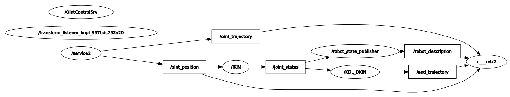

# Zadanie_5

### `custom_urdf` -pakiet ROS, przechowuje logikę napisanego programu
### `install` - folder, pozwalający zidentyfikować źródło
### `IKIN` - węzeł, wyliczający kinematykę odwrotną
#### Aby uruchomić system należy:
##### Wsyztkie polecenia należy wpisywać w terminalu(`CTR+ALT+T`)
1. Pobrać repozytorium za pomocą polecenia `git clone 'https://github.com/pw-eiti-anro-21l/klimuk_stankevich.git'`
2. Przejść do foldera **klimuk_stankevich** za pomocą polecenia `cd klimuk_stankevich/`
3. Wywołać `colcon_build`
4. Wywołać `. install/local_setup.bash`
#### Uruchomienie systemu:
1. Uruchomić potrzebne węzły za pomocą polecenia `ros2 launch custom_urdf IKIN_and_oint_launch.py`
2. Uruchomić rviz za pomocą launch pliku `ros2 launch custom_urdf rviz_for_IKIN_launch.py`
3. Wymusić interpolację poprzez klienta `ros2 run custom_urdf client2 <nowa_wartość_stawu_shoulder> <nowa_wartość_stawu_elbow> <nowa_wartość_stawu_wrist> <czas_interpolacji> <przebieg_prędkości> <pożadana trajektoria(rectangle/elipse)>`

#### RQT:

