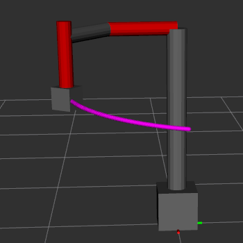
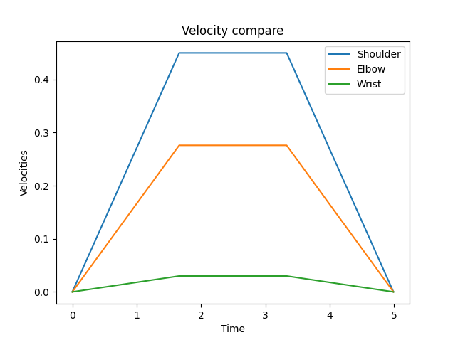
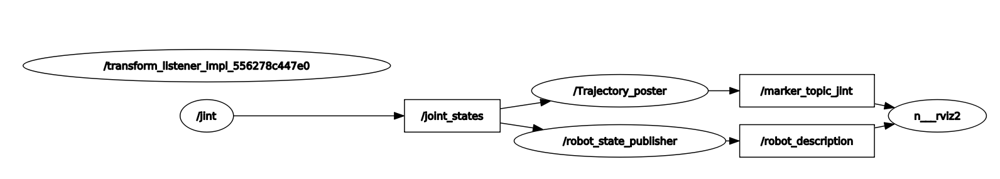
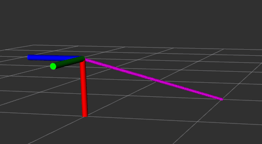
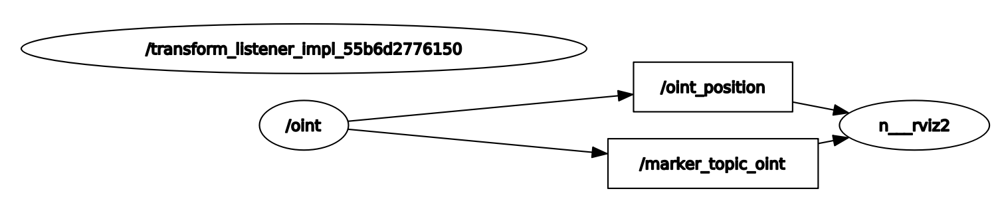

# Zadanie_3

### `custom_urdf` -pakiet ROS, przechowuje logikę napisanego programu
### `install` - folder, pozwalający zidentyfikować źródło
### `my_robot_interfaces` - pakiet ROS przechowujący pliki konfiguracyjne `srv`
#### Aby uruchomić system należy:
##### Wsyztkie polecenia należy wpisywać w terminalu(`CTR+ALT+T`)
1. Pobrać repozytorium za pomocą polecenia `git clone 'https://github.com/pw-eiti-anro-21l/klimuk_stankevich.git'`
2. Przejść do foldera **klimuk_stankevich** za pomocą polecenia `cd klimuk_stankevich/`
3. Wywołać `colcon_build`
4. Wywołać `. install/local_setup.bash`
#### Uruchomienie węzła `jint` :
1. Uruchomić serwer `ros2 run custom_urdf service`
2. Uruchomić rviz za pomocą launch pliku `ros2 run custom_urdf jint_launch.py`
3. Wymusić interpolację poprzez klienta `ros2 run custom_urdf client <nowa_wartość_stawu_shoulder> <nowa_wartość_stawu_elbow> <nowa_wartość_stawu_wrist> <czas_interpolacji> <przebieg_prędkości>`

#### Przebiegi prędkości:

#### RQT:

#### Uruchomienie węzła `oint` :
1. Uruchomić serwer `ros2 run custom_urdf service2`
2. Uruchomić rviz za pomocą launch pliku `ros2 run custom_urdf oint_launch.py`
3. Wymusić interpolację poprzez klienta `ros2 run custom_urdf client2 <nowa_pozycja_x> <nowa_pozycja_y> <nowa_pozycja_z> <nowa_orientacja_x> <nowa_orientacja_y> <nowa_orientacja_z> <nowa_orientacja_w> <czas_interpolacji>`

#### RQT:

