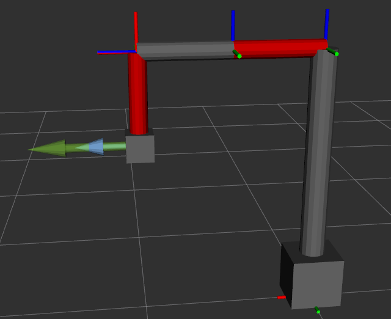
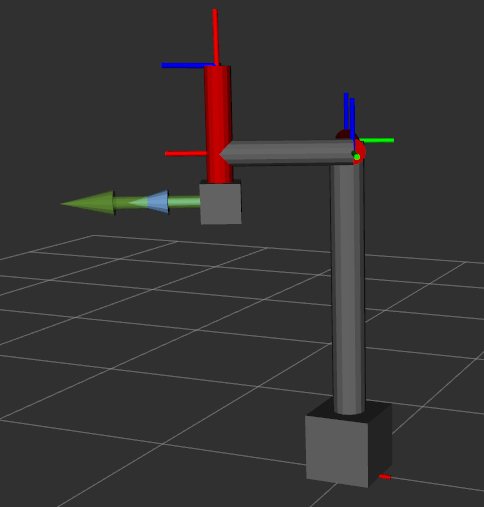
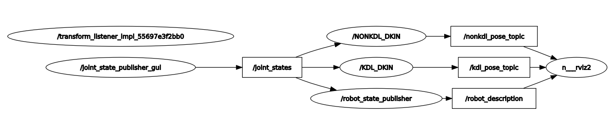

# Zadanie_3

### `custom_urdf` -pakiet ROS, przechowuje logikę napisanego programu
### `install` - folder, pozwalający zidentyfikować źródło
#### Aby uruchomić system należy:
##### Wsyztkie polecenia należy wpisywać w terminalu(`CTR+ALT+T`)
1. Pobrać repozytorium za pomocą polecenia `git clone 'https://github.com/pw-eiti-anro-21l/klimuk_stankevich.git'`
2. Przejść do foldera **klimuk_stankevich** za pomocą polecenia `cd klimuk_stankevich/`
3. Parametry DH są przechowywane w pliku `params.yaml` w folderze **config**
4. Wpisać polecenie `colcon build --packages-select custom_control`
5. Proces uruchomienia węzła:
  - Otworzyć nowe okno terminala, przejść do foldera klimuk_stankecich i wpisać `. install/local_setup.bash `
  - Wpisać polecenie `ros2 launch custom_urdf nazwa_węzła_launch.py` 
6. Uruchomić węzeł **claculate_params** , zamknąć nowopowstały terminal.
7. Urucomić węzeł **NONKDL_DKIN**.
8. Urucomić węzeł **KDL_DKIN**.
9. Wpisać polecenie `ros2 launch custom_urdf view_robot_launch.py `
10. Zmieniając plik `params.yaml` (czyli zmieniając parametry DH) i ponownie uruchamiając launch'e dostajemy wizualizację o aktualnych (zmienionych parametrach):
11. Aby zwizualizować działanie węzłów **KDL_DKIN** i **NONKDL_DKIN** należy:
  - W programie Rviz wcisnąć `CTRL + O`
  - Przejść do folderu **config** i wybrać plik `rviz_config.rviz`
13. Dla zakończenia pracy sytemu należy wcisnąć `CTRL+C` i zamknąć otwarte terminale

### Wyniki(Zielona strzałka - węzeł KDL, niebieska - NONKDL):
     

### RQT graf systemu 

