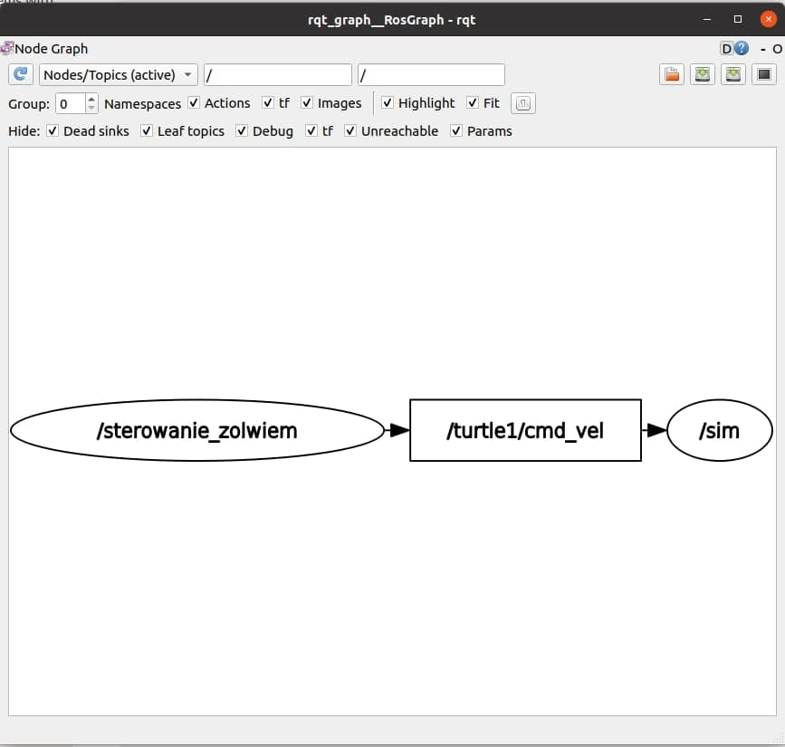

# Laboratorium pierwsze, Stanislau Stankevich
### System:
- Pakiet ROS o nazwie `package_lab1`
- W nim węzeł do sterowania żółwiem o nieoczywistej nazwie `sterowanie_zolwiem`
- Plik launch do uruchomienia systemu o nazwie `sterowanie_zolwiem_launch.py`

### Proces uruchamiania:
1. Klonowanie repozytorium na system lokalny za pomocą polecenia `git clone -b sstankev_lab1 --single-branch https://github.com/pw-eiti-anro-21l/klimuk_stankevich`)
2. W pobranym katalogu otwieramy terminal (w nim jak i w każdym innnym robimy `source gdzie/zainstalowany/jest/ROS2/setup.bash`)
3. Budujemy pakiet za pomocą polecenia `colcon build --packages-select package_lab1`
4. W tym samym katalogu otwieramy terminal i robimy `. install/local_setup.bash`
5. W tym drugim terminalu idziemy do `cd package_lab1/launch_lab1` 
6. i uruchamiamy system za pomocą `ros2 launch sterowanie_zolwiem_launch.py`

### Opis:
#### Węzeł `sterowanie_zolwiem`:
- Klasa węzła o zadeklarowanych czterech parametrach (4 klawisza które powodują ruch albo obrót, w tym przypdaku **w**, **d**, **s** i **a**)
```
class SterowanieZolwiem(Node):

    def __init__(self):
        super().__init__('sterowanie_zolwiem')
        self.publisher_ = self.create_publisher(Twist,'/turtle1/cmd_vel', 10)
        self.new_velocity = Twist()
        self.declare_parameter('forward','w')
        self.declare_parameter('backwards','s')
        self.declare_parameter('left','a')
        self.declare_parameter('right','d')
```
- Wykrywanie naciśnięć klawisz za pomocą biblioteki pythonowej **curtsies** obiekt `Input()`:
```
    def get_key(self):
    	with Input(keynames='curtsies') as input_generator:
    		for e in Input():
    			return e
```
- Funkcja własna (przykład, pozostałe są takie same) do publikowania prędkości:
```
    def move_forward(self):
    	self.new_velocity.linear.x = 1.0
    	self.new_velocity.angular.z = 0.0
    	self.publisher_.publish(self.new_velocity)
```
- Funkcja pobierająca wartość naciśniętego klawisza i wywołująca odpowiednią funkcję ruchu:
```
    def move_control(self):
    	key = self.get_key()
    	if key == self.get_parameter('forward').get_parameter_value().string_value:
    		self.move_forward()
    	elif key == self.get_parameter('backwards').get_parameter_value().string_value:
    		self.move_backwards()
    	elif key == self.get_parameter('left').get_parameter_value().string_value:
    		self.turn_left()
    	elif key == self.get_parameter('right').get_parameter_value().string_value:
    		self.turn_right()
```
### RQT graf systemu 

