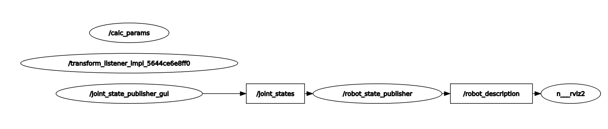

# Zadanie_2

### `custom_urdf` -pakiet ROS, przechowuje logikę napisanego programu
### `install` - folder, pozwalający zidentyfikować źródło
#### Aby uruchomić system należy:
##### Wsyztkie polecenia należy wpisywać w terminalu(`CTR+ALT+T`)
1. Pobrać repozytorium za pomocą polecenia `git clone 'https://github.com/pw-eiti-anro-21l/klimuk_stankevich.git'`
2. Przejść do foldera klimuk_stankevich za pomocą polecenia `cd klimuk_stankevich/`
3. Wpisać polecenie `colcon build --packages-select custom_control`
4. Otworzyć nowe okno terminala, przejść do foldera klimuk_stankecich i wpisać `. install/local_setup.bash `
5. Wpisać polecenie `ros2 launch custom_urdf calculate_params_launch.py `, zamknąć nowopowstały terminal.
6. Wpisać polecenie `ros2 launch custom_urdf view_robot_launch.py `
7. Dla zakończenia pracy sytemu należy wcisnąć `CTRL+C` i zamknąć otwarte terminale

### RQT graf systemu 

