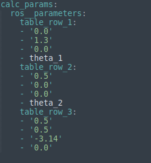

# Zadanie_2

### `custom_urdf` -pakiet ROS, przechowuje logikę napisanego programu
### `install` - folder, pozwalający zidentyfikować źródło
#### Aby uruchomić system należy:
##### Wsyztkie polecenia należy wpisywać w terminalu(`CTR+ALT+T`)
1. Pobrać repozytorium za pomocą polecenia `git clone 'https://github.com/pw-eiti-anro-21l/klimuk_stankevich.git'`
2. Przejść do foldera klimuk_stankevich za pomocą polecenia `cd klimuk_stankevich/`
3. Parametry DH są przechowywane w pliku `params.yaml` w folderze **config**
4. Wpisać polecenie `colcon build --packages-select custom_control`
5. Otworzyć nowe okno terminala, przejść do foldera klimuk_stankecich i wpisać `. install/local_setup.bash `
6. Wpisać polecenie `ros2 launch custom_urdf calculate_params_launch.py `, zamknąć nowopowstały terminal.
7. Węzeł `calc_params` pobiera dane z pliku `params.yaml` w którym znajduje się dane tabeli DH i tworze na ich podstawie nowy plik `joint_params.yaml` w którym te dane zostają reprezentowane w postaci adekwatnej dla URDF.
8. Wpisać polecenie `ros2 launch custom_urdf view_robot_launch.py `
9. W tym momencie aktualne dane z pliku `joint_params.yaml` zostaja zaimportowane do pliku `custom.urdf.xacro` i xacro-plik zostaje przekonwertowany na aktualny URDF, na podstawie którego RVIZ tworzy wizualizację.
10. Zmieniając plik `params.yaml` (czyli zmieniając parametry DH) i ponownie uruchamiając launch'e dostajemy wizualizację o aktualnych (zmienionych parametrach):

 
 
 

11. Dla zakończenia pracy sytemu należy wcisnąć `CTRL+C` i zamknąć otwarte terminale

### RQT graf systemu 

